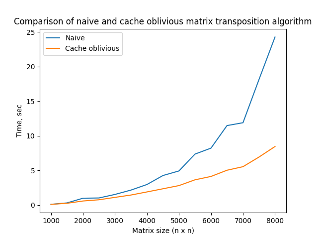

# Сравнение времени работы наивного и кэш-эффективного алгоритма транспонирования матрицы
Реализовано было 2 алгоритма, асимптотика каждого O(n2):

1. `naive_algorithm.py` – наивный алгоритм, идет по всем столбцам последовательно и записывает значения из них в соответствующие
   последовательные строки.
1. `cache_oblivious_algorithm.py` – кэш-эффективный алгоритм, на каждом этапе разделяющий обрабатываемый участок пополам по большей
   стороне. После определённого размера будет транспонировать участок матрицы наивно.

## Результаты тестирования
Данные получены в результате усреднения множества запусков `(5)` на интервале `[1000; 8000]` c шагом `500`: 

Как видно по графику, при небольших значениях разницы нет, однако на больших значениях кэш-эффективный алгоритм явно выигрывает.

Требования:

1. `python 3.x`
1. python lib `matplotlib`

Запуск:

Для проверки необходимо запустить `run_tests.cmd` или использовать `python do_tests.py <кол-во тестов> <начальный размер матрицы> <конечный размер матрицы> <шаг>`
